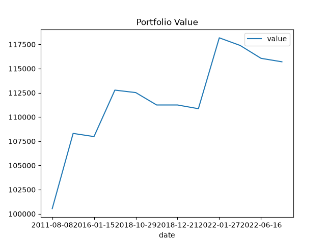
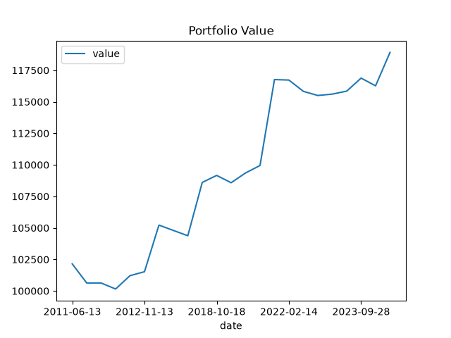
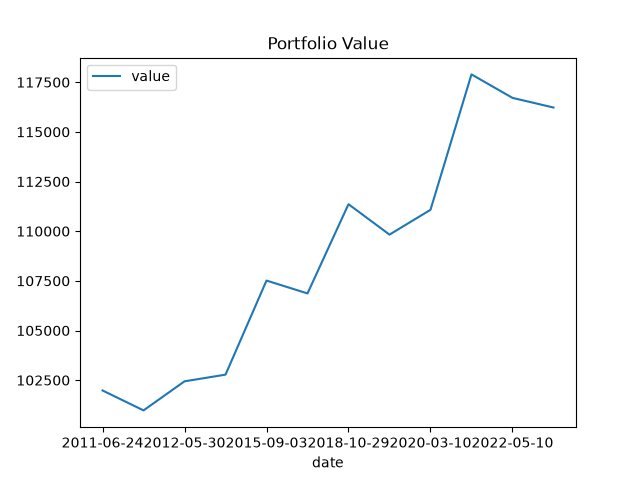
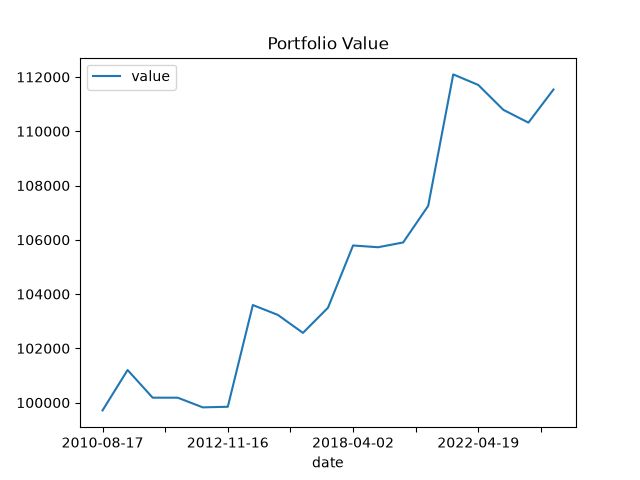

# Event-Driven Backtester

A simple **event-driven backtester** implementing a **Moving Average Crossover strategy**.

## Flow

* Retrieves historical market data over a given time period with a **1-day interval**
* Feeds data bar-by-bar into the system using `MarketEvent`
* The strategy calculates two moving averages
* When the averages cross, a `SignalEvent` is generated (BUY/SELL signal)
* The `Portfolio` receives the signal and determines position sizing
* An `OrderEvent` is created to represent the trade
* The `ExecutionHandler` acts as a simulated broker and processes the order
* A `FillEvent` is returned with execution details
* The `Portfolio` updates its positions based on the fill

## Event Flow

```text
Market Data
    ↓
MarketEvent
    ↓
Strategy (Moving Average Crossover)
    ↓
SignalEvent
    ↓
Portfolio (Position Sizing)
    ↓
OrderEvent
    ↓
ExecutionHandler (Broker Simulation)
    ↓
FillEvent
    ↓
Portfolio Update
```

## Moving Average Windows

The strategy was tested using different combinations of short-term and long-term moving average windows:

### 30 / 10 Moving Average Crossover

* Short moving average: **10 days**
* Long moving average: **30 days**
* Generates signals when the 10-day average crosses the 30-day average



### 50 / 10 Moving Average Crossover

* Short moving average: **10 days**
* Long moving average: **50 days**
* Generates signals when the 10-day average crosses the 50-day average



### 50 / 20 Moving Average Crossover

* Short moving average: **20 days**
* Long moving average: **50 days**
* Generates signals when the 20-day average crosses the 50-day average




### 100 / 10 Moving Average Crossover

* Short moving average: **10 days**
* Long moving average: **100 days**
* Generates signals when the 10-day average crosses the 100-day average



